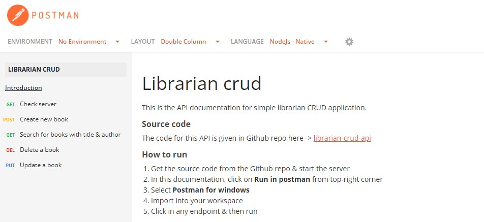

# Librarian CRUD API

This is a simple CRUD application where a librarian who can create books with authors. This application is a **RESTful API**.

<em> The **API endpoints** and the **API documentation** can be found [here in Postman documentation](https://documenter.getpostman.com/view/14185987/2s83zduQzF) </em> 



## Features:
- librarian can create new books with ``title`` & ``author``
- librarian can get the full list of created books
- librarian can search for books with ``title`` and/or ``author``
- librarian can edit any book's details
- librarian can delete any book

## Tech used:

**Runtime environment**
- [x] Node.js

**Database**
- [x] MongoDB

**Testing framework & library**
- [x] Jest
- [x] SuperTest

## Getting the app:
### Using Git (recommended)
1. Navigate & open CLI into the directory where you want to put this project & Clone this project (will be cloned inside librarian-crud-api folder) using this command.
   
```bash
git clone https://github.com/tazbin/librarian-crud-api.git ./librarian-crud-api
```
### Using manual download ZIP
1. Download repository
2. Extract the zip file, navigate into it & copy the folder to your desired directory

### Running the app:
To build docker image
```bash
docker compose build --no-cache
```

To run he containers in detached mode (wait for a while for database connecton)
```bash
docker compose up -d
```

To view running containers
```bash
docker container ps
```

To view API logs
```bash
docker logs librarian-api-c
```

To run tests, first enter within the API container
```bash
docker exec -it librarian-api-c /bin/sh
```
Then, run this command to execute tests
```bash
npm test
```
To exit from API container, press ```CTRL + D``` on terminal

To stops the containers
```bash
docker compose down
```
